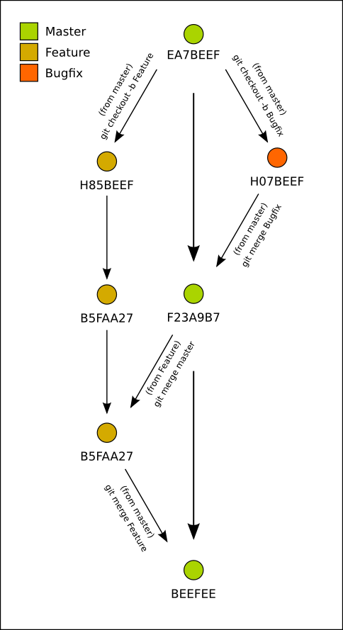

Today let's look at version control. People use version control to manage different versions of software(among other things). I'm going to be discussing [git](https://en.wikipedia.org/wiki/Git), a distributed version control system(DVCS) that originally was built to manage linux kernel development.

What makes git unique when compared to other version control systems is that it is distributed and it is written in C. There is no single master server that manages all history, meaning that there is no single point of failure in a git server deployment except in cases of poor architecture or planning. This is convenient for systems that have a goal of high availability; if one git server goes down another one can still be used. Or one can do away with a git server entirely and send [diff patches](http://en.wikipedia.org/wiki/Diff) directly to a system. Because git is written in C it has the potential to be fast. And in practical use it typically is indeed fast at completing local version control operations, such as branching and merging.

Version control systems are architected as graphs. For those unfamiliar this means a system of nodes and lines that connect them. Every version of a codebase(or whatever information you're versioning) is stored as a node on a graph. The connections between nodes represent different lineages of changes made to versioned files.

Here's an image of a hypothetical git history to consider:



Different children of the same lineage began as the same information, but they may have been modified in different ways. In the above graph this can be explained by looking at two or more nodes coming out of the same parent node. For instance commit `H07BEEF` and `H85BEEF` both are children of `EA7BEEF`. Note that the 7 character strings in this image represent an identifier for the code at that point in time. Both `H07BEEF` and `H85BEEF` originally came from `EA7BEEF`; They began as the same code. Here's what the code might have looked like at each commit:

At commit `EA7BEEF`:
```python
    def hello():
        print "hi!"
```

At commit `H07BEEF`:
```python
    def hello()
        print "hello!"
```

At commit `H85BEEF`:
```python
    def hello()
        print "hello!"

    def hi_there():
        print "hi there!"
```

And between these three states there were two changes that occurred, as represented by the arrows coming out of `EA7BEEF` in the diagram: 
 - A branch named Feature was created from master
 - A branch named Bugfix was created from master

When the Feature branch was created the following changes occurred in the file:

```
@@ -1, 2 +1,5 @@
+   
+    def hi_there():
+        print "hi there!"
```

And in the Bugfix branch, the following changes occurred in the file:\

```
@@ -1, 2 +1,2 @@
>-    def hello()
+    def hello():
```

The above notation is referred to as a diff. This is short for difference. Each of the lines in the above graph can be represented as a diff. This simply means that the lines in the graph each represent a change in the versioned files in the project.

Git represents changes in files purely in text. For each line that changes in a file between commits, there is a difference. That difference is what git walks through to create a lineage.

In the example diffs above you may have noticed that there is a line wrapped in double at symbols. This line says where in the file a change occurred. Beneath this line there are lines prepended with either plus or minus. This represents either removals or additions in lines to a file. In our example, the diff between `EA7BEEF` and `H07BEEF` was the addition of a colon the the end of the function definition of the function titled hello. Since git works on a per-line basis, git detected that `def hello()` is not identical to `def hello():` and so the line was deleted. A new line was added with the same contents and an additional colon.

Likewise in the Feature branch git detected three additional lines that added an empty lineand a function declaration for a function titled `hi_there`. 

Each node can have its own children in git. Each of these divisions is called a branch. This sort of structure is referred to as a tree, hence the name branch. The trunk of the tree is the centermost lineage from where all of the branches originate. In software projects it's common to have one master branch(usually eponymously titled 'master') and for individual features or fixes to that project to be branches out of master. When a feature or fix is completed it is merged back into master.