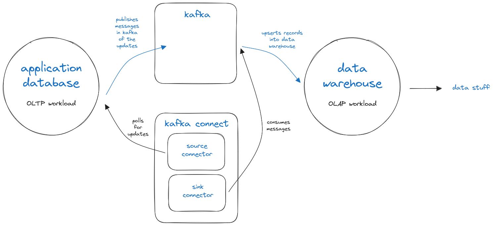
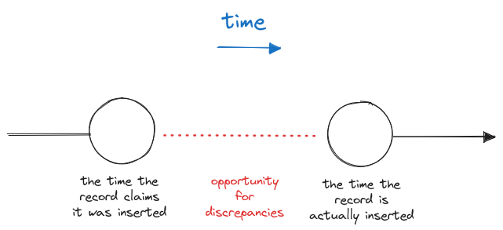

I've been leading a reporting project at work for the past 1.5 years. Recently we noticed some data discrepancies and I thought it might be interesting to share thoughts on one particular issue we encountered related to kafka connect, change detection, and clocks in distributed systems.

## A brief history
At JazzHR we have an application database and a data warehouse, used for reporting purposes. We leverage [Kafka](https://kafka.apache.org/) to sync changes from the application database to the reporting warehouse. Many of these data flows are conducted using kafka connect, and are configured to poll for changes on an interval, using the "timestamp" source connector mode. 



Let's say in the application database we have a table of users defined as follows:

| id | firstName | updatedAt |
| - | - | - |
| 1 | gabe | 2023-01-01 12:00:00 |
| 2 | john | 2023-08-31 12:09:15 |

When the user record is updated, the "updatedAt" column is updated to the current timestamp. In the timestamp mode and the timestamp+incrementing mode of kafka source connectors, this value will be polled to tell if the record was changed. In our example, let's say I updated user 1's name at 12:15:00, then you might see something like this:

| id | firstName | updatedAt |
| - | - | - |
| 1 | gabriel | 2023-08-31 12:15:00 |
| 2 | john | 2023-08-31 12:09:15 |

Let's say that the connector next runs at 12:16:00. It might run a query that looks like the following:

```sql
select id, firstName, updatedAt
from users
where updatedAt > '2023-08-31 12:09:15'
and updatedAt <= '2023-08-31 12:16:00';
```

## The issue
After a couple months of our kafka connect powered data pipelines being operational we noticed discrepancies between the application database and the data warehouse. In amounts greater than 1%, which was unexpected, and initially puzzling. We went to the drawing board and sketched out possible ways discrepancies could be introduced. Through the process we honed in on one issue in particular because we realized it was systemic: clock differences.

Something I glossed over in my example above is that the "updatedAt" timestamp is actually set _by the application code_.  This led to the realization that our system tends to "back-date" records when it creates them: If the application processes an http request and the current time is 12:00:00.00, by the time the changes are persisted in the database, some time likely transpired. That means the record could have been inserted at 12:00:01.00 but application code may claim that it was updated at 12:00:00.50. In most web-app usages of a transactional database, a discrepancy like this isn't concerning. Unfortunately, given the way that we're polling these tables to ingest the data into the warehouse, this discrepancy is problematic.




If the polling mechanism happens to query for updates between when a record claims it was inserted and when it was actually inserted, then the change may be missed entirely. Readers familiar with kafka connect source connector modes may be aware that source connectors in timestamp mode set the "older" boundary timestamp from the value of the final record found in the previous batch; because there is no guarantee of ordered upserts there remains a possibility of a "data leak" here.

With the potential problem in mind we brainstormed through possible prototypes to test our theory and potential solutions. We explored three tracks:

1. Database-driven timestamps

    If we were building things from scratch the proper solution would be to make the database responsible for generating these timestamps. Because these were occurring on highly trafficked tables, making such a schema change in mysql may require some downtime. As a result we pursued this approach for one of our data-flows, and we actually wound up creating an alternate version of the table and migrating in old data in order to avoid issues in orchestrating schema changes on said heavily used tables.

2. Adding a delay to the connector

    Another idea we explored was shifting the window of time in which connect polls. As it turns out the `timestamp.delay.interval.ms` configuration option for jdbc source connectors did this very thing. You can think of this as shifting the recurring window from [60 seconds ago, now] to [70 seconds ago, 10 seconds ago]. This shift acts as a grace period for "back-dated" records to get persisted, mitigating the problem. We landed on this approach for the rest of our data-flows. While this introduced a slight delay to our pipeline, it was fairly minor and it prevented us from undertaking more expensive approaches.

3. Switching the mode of the connector to bulk and scoping it to a small window of time, similar to how timestamp mode works.

    For this option we adjusted the query to shift the time window like so: 
    ```sql
    select id, firstName, updatedAt
    from users
    where updatedAt >= date_sub(utc_timestamp, interval 1 minute);
    ```

    This resolved the discrepancy issue but after we let it run over a weekend we discovered that it introduced two new issues:
        a. Due to a replication latency event in our application database cluster, we missed data for a window of time. As it turns out, we discovered that the timestamp and timestamp+increment modes of kafka connect source connectors handle this by polling for records _since the greatest timestamp in the last successful batch._ Unfortunately these events are not uncommon on our system, so this discovery ended our exploration of this prototype.
        b. We initially prototyped this at a less frequent interval, but set it to ingest more time(e.g. run every 1 minute, ingest 5 minutes of history), which meant that we needed to either dedupe the data in some manner or just process a higher volume of data.

Ideally in the future this is an area where JazzHR could invest future resources. A more robust change data capture system, like [debezium](https://debezium.io/), could prevent these problems.