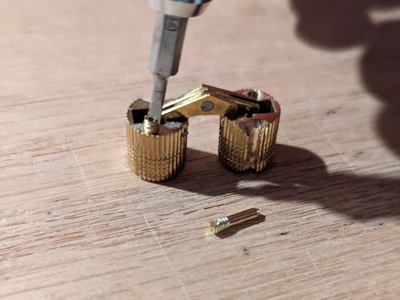
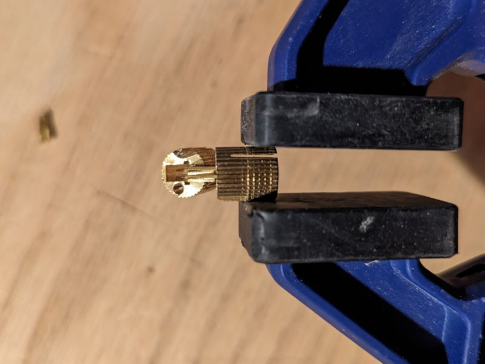
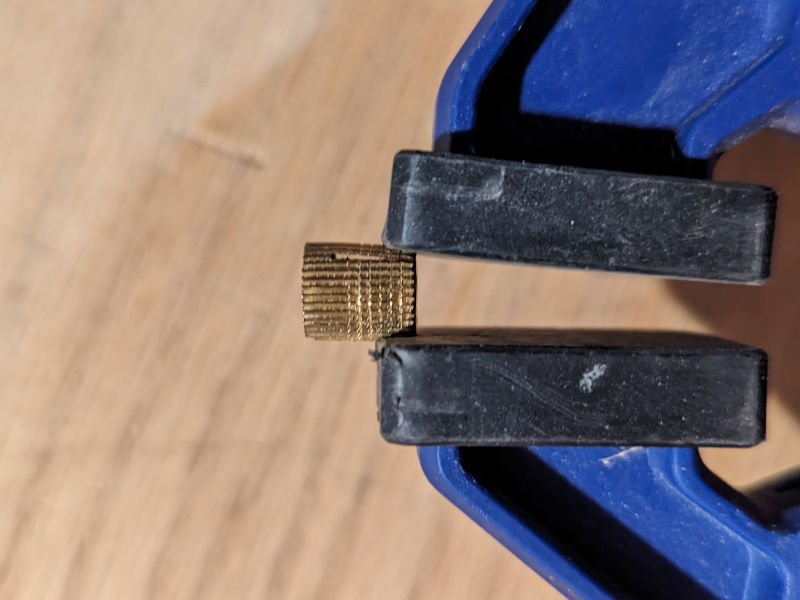
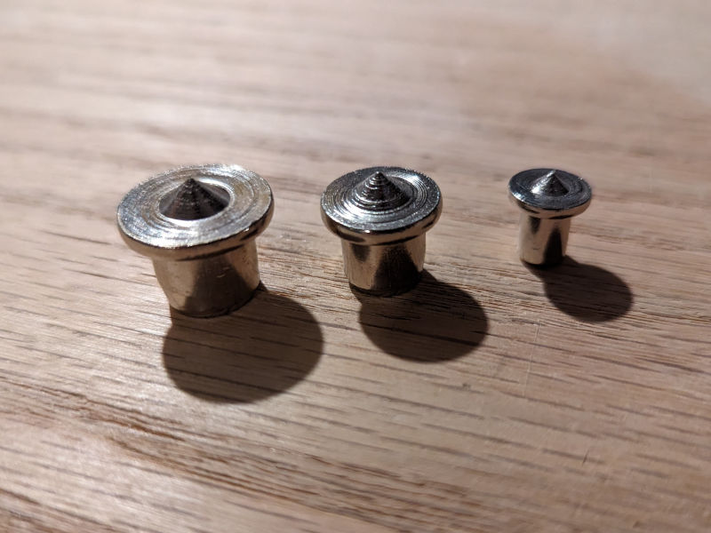
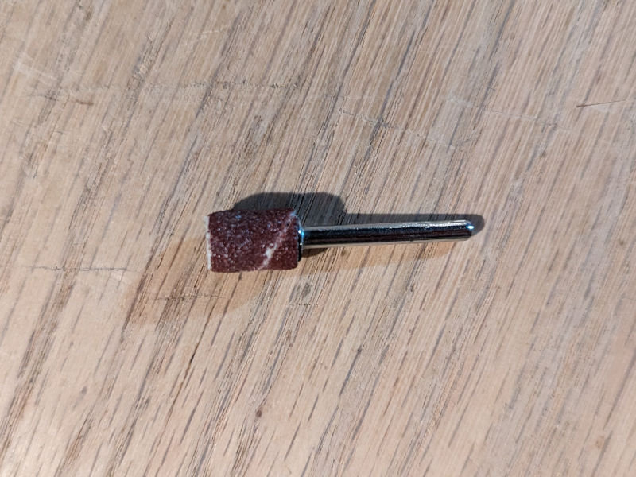
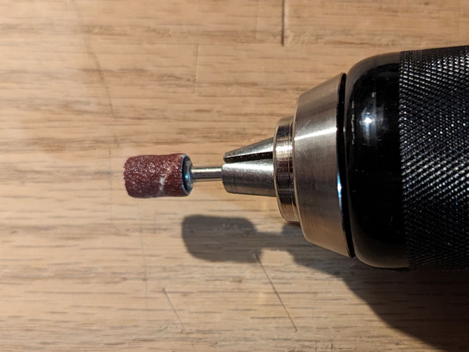

Rockler sells a what they call a [hidden barrel hinge](https://www.rockler.com/hidden-barrel-hinges-select-size). Installation for these versus other hinges is simple, but when you use these there’s little room for error and it’s difficult to fix mistakes. I used these on a recent project because I wanted a box top with the hinges hidden while shut. Here are some recommendations I have for installation:

## Do

1. Before you try to fit the barrels into any holes take the screws out of the hinge. The screws serve to expand the barrel wing. They are very small and I recommend you put them back into the bag that the hinge was packaged in until you are ready for final installation.
    
    Next, bend the barrel wing down so that it's easy to fit into your hole.
    

    

2. Create a jig to make hole layout consistent. Take a board with at least one square, flat edge. Route a groove along the edge using the flat edge as the reference face. Then measure the thickness of your workpiece and layout holes on the jig where you desire. Rockler shares some recommendations, but you can eyeball it reasonably. Just make sure to leave proper clearance for the pieces to open and close.
    
    I recommend drilling the holes in the jig with a drill press to keep them as square as possible.

    When you are drilling holes into your workpiece, cut a mark where you intend to put the hole, then move the jig into place, letting your drill bit catch in the mark. Keep the jig square and firmly against the piece as you drill. Again, consider using a drill press if you have the clearance, as it will help keep the hole square.

    Don't go crazy with the depth--in fact you might not want to even drill as deep as the barrel on your first pass if you are transfering hole marks with dowel centers.

3. Use a drill bit the same diameter as the barrel to make the holes. Rockler sells these in metric, so you will need to have metric bits. Drill to slightly deeper depth than the barrel needs when you are ready to test its fit.

4. Consider using a dowel center set to transfer hole positions between your two workpieces.
    
    Drop these into your drill holes and align the second workpiece. Give it a light squeeze to transfer the marks.

5. Sand the inside of the drilled hole using a small sanding drum with your drill. Sneak up on a snug fit with the hinges.
    

    

## Don’t

1. Don’t round off/sand the edges of the drill holes. The hinges will be flush with the surface of both pieces and if you round the top it will look and feel off.
2. Don’t tap or hammer the barrel into the hole. If it's this snug, you probably aren't going to get the barrel back out, and you won't be able to rotate it to adjust its alignment.
3. Don’t handplane the two joined pieces flush with the hinges in place. The stress could break or bend the hinges. Install hinges after you’ve planed and/or machined your pieces flush with one another.

## Other notes

1. Glue is not necessary for smaller projects. If your hinge fit is snug, then the screw should sufficiently hold it in place. When I used these hinges for my small jewelry-box sized project no glue was unnecessary.