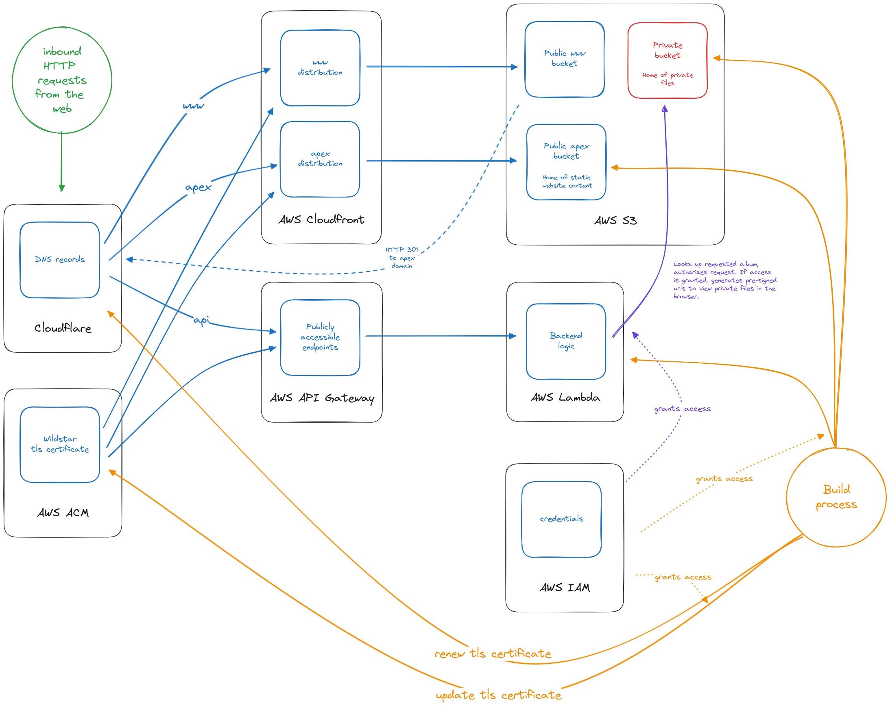
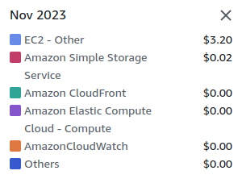

I thought it might be interesting to share how this website works and how I went about building it.

As you may be aware, the intent of this website is both to be a publicly accessible blog as well as a way for me to share photos and other media privately in place of a consumer service like google photos.

# Requirements

1. Run a website with static content that I can update at will. My old blog was static, my new blog is static, I don't personally have a need to be able to dynamically update content. I'm content deploying a new version of it whenever I publish new content or to revise things.
2. Create a way to share photos with family and friends that is easily accessible--just by visiting a url--but also is fairly secure. I want to avoid putting private photos on urls that could be easily guessed or scraped, so I intentionally avoided putting everything on a static site.

# Demonstration

You can click around to see the static blog content. [Here](https://gabrielmiller.org/album.html?title=test-story-for-demonstration-purposes&token=A05cl235d20KJ;t3P0772.cvDN4541FhqpQnRZ03-10216N4b0,23FPN1Cdg10d3) is an example of a private album.

# Architecture

Here's a diagram of the infrastructure that powers this website:

If you want to peer at the sourcecode, check it out [here](https://github.com/gabrielmiller/gabrielmiller.org).

# Costs

My goal was to spend as little money as possible.

Objective: extreme frugality.

This website uses several different products that amazon web services(AWS) and cloudfront offer. Here's a little breakdown:

1. Paid offering: File hosting - Amazon S3
2. Paid offering: Making a static website out of hosted files - Amazon Cloudfront
3. Paid offering: Providing access to private content by presigning files - Amazon Lambda
4. Paid offering: Interacting with lambda through HTTP - Amazon API Gateway
5. Free offering: Certificate Management - Amazon ACM
6. Free offering: Identity and Access Management - Amazon IAM
7. Free offering: DNS - Cloudfront
8. Free offering: TLS certificates - Letsencrypt + certbot with dns-based challenge

Of the paid services:
- S3 is metered by volume of api calls and network usage. If I were to suddenly take on a lot of traffic it would grow in cost, but still at a highly affordable rate.
- Cloudfront is metered by data transfer to the internet and requests served. I'm within the bounds of the free tier because my website is not high traffic, but even if I weren't it grows at a highly affordable rate.
- Lambda is metered by "gb-seconds" which loosely equates to compute usage over time. Again, it's priced at highly affordable rates, and on top of that I'm using very little compute time because my backend is so simple and uses very minimal resources.
- API Gateway is metered by HTTP requests received and "connection minutes". I'm also within the bounds of the free tier because my website doesn't serve much traffic, but it grows at an affordable rate.

By using these services I benefit from low prices due to economies of scale. Additionally, they each scale up at affordable rates, so if my website were to suddenly become very popular I would still not pay much.

In order to get to low costs, I went through a series of cost-cutting measures. I initially invisioned things a bit differently than they turned out and it was a bit of a journey to cut costs in various ways.

Initially I wrote my backend as an HTTP server running on an AWS EC2 instance. I naively thought that if I used the smallest EC2 instance possible it would be the cheapest way to go about things. As it turns out, AWS(and probably other cloud providers) offer many services that commodify the common needs of a traditional backend(amongst other capabilities) at competitively low prices.

1. I started my journey with an x86 ec2 instance. After looking at pricing pages on AWS I discovered that if I were using an ARM instance I would pay a fair bit less than x86. In the AWS UI the x86 instances are the first option and I didn't initially give much thought to there being cheaper offerings if I used a different processor architecture. On AWS the cost difference between x86 and ARM in lower-end instances is somewhere around 16%. Because I am using go for my backend the changes required to the software itself was minimal: I updated the target architecture flag to ARM64 when running `go build` in the build process. After revising my build process I replaced my x86 ec2 instance with an ARM instance. At this point I prepaid for the lowest tier of an ARM64 instance to minimize costs. Doing that I was able to get down to about $1.14/month or 13.66$/yr.
2. Next I looked at remaining recurring costs and moved down the line. DNS was next up. I had been using Amazon Route 53, however it costs $0.50 per hosted zone per month, or $6/yr. Cloudfront does not charge for DNS and is well supported by the tools in the ecosystem--in particular I am using Letsencrypt and Certbot and there's a Cloudfront DNS challenge plugin for it. This was pretty minimal change but it did involve transferring my domains which took several days.
3. The largest cost saving measure I went through was initially to avoid an upcoming cost. At some point I received a notice that AWS was going to start charging for elastic IPs. While using ec2 I was relying upon an elastic ip address as an ingress, to give internet traffic access to my node. This change goes into effect in February 2024 but it was prohibitive enough for me to proactively rethink things. It's somewhere around $43/year for each IP address. I wound up researching different ways to route internet traffic to an AWS service. One option I read about was to only use IPv6. If you were to use AAAA dns records for IPv6 traffic then you don't need to pay for an elastic IP (ipv4) address. The trouble here is that there's still a considerable number of devices and infrastructure that only can access the internet via IPv4. Even my own router is not set up for IPv6 yet, which convinced me that was not going to be a good option yet. Eventually I landed on using AWS's API gateway as an ingress. At this point I could have pointed the traffic at my ec2 instance, but I figured I should try using a Lambda because it could potentially be cheaper than a dedicated ec2 instance. Again, fortunately for me, my backend functionality is rather basic and refactoring it to invoke through a lambda required minimal changes. The backend looks up files in a private S3 bucket, authorizes the user, and if authorized, returns presigned urls for files in the same private bucket. My backend, now in Lambda format, has a svelte binary of just a couple megabytes. It doesn't even need 128MB of memory to run, and my understanding is to presign files it doesn't need to make network requests. Probably most of the time spent running it is waiting for responses from s3. That's all to say the amount of resources it uses is minimal, and therefore the cost of it is minimal.
4. Finally, I went through another migration from x86 to ARM once in a Lambda. This saved about 20% in cost, and was as simple as updating a line of configuration.

Cost-wise, it's been a success. Here's the first month after migrating to serving traffic with my lambda, November 2023. Note that I did not decommission my ec2 instance until part-way through the month, so it is not part of the recurring costs here.

This partially is an admission that I serve very little traffic, but even still I'm delighted that I'm paying mere pennies a month for my home-grown photo-sharing service and blog.

Cheers!